## 1. Customer Buys Airtime (Vodacom R 29)

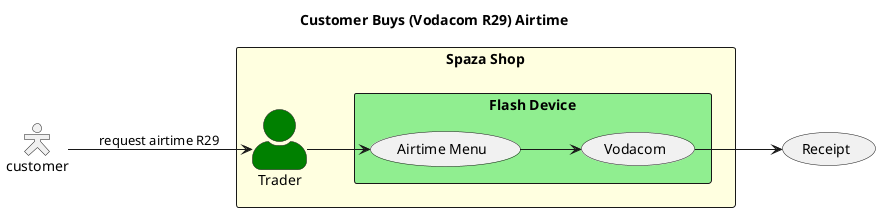


2. Cash Deposit → Trader Treasury Credit
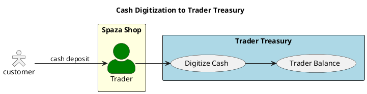

3. Trader Treasury → Airtime Token

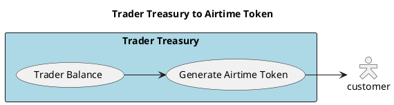
4. Best Case Airtime Purchase
plantuml
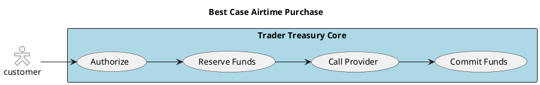
5. Non-Ideal Case – Provider Switching
plantuml
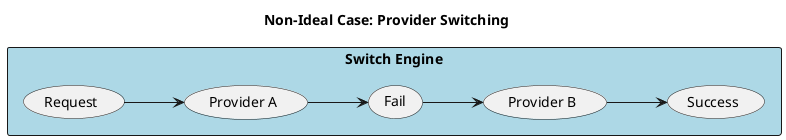
6. Trader Treasury – High-Level Components

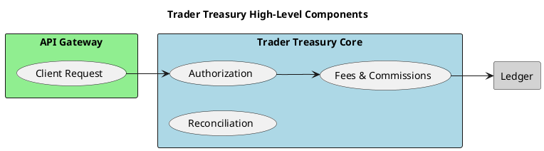
7. Response & Reconciliation
plantuml
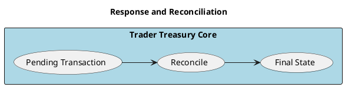
8. Trader App Evolution
plantuml
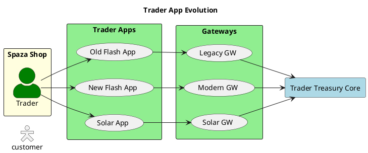
9. Request Lifecycle
plantuml
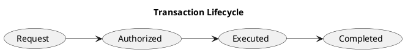
10. Authorization Rules
plantuml
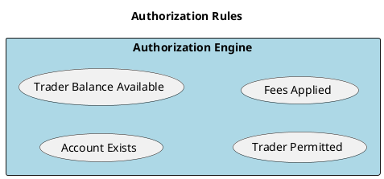
11. Airtime Transaction Example
plantuml
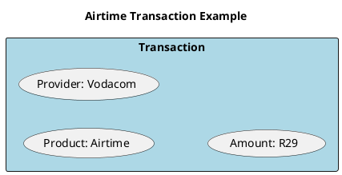
12. Purchase & Fund Reservation
plantuml
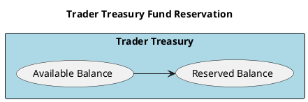
13. Product Types

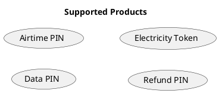
14. Failure Handling

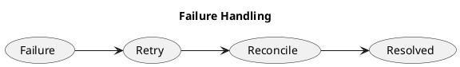
15. PIN-less Delivery Principle

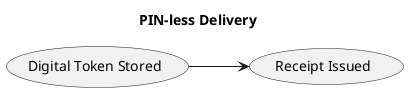
16. Electricity Token Routing

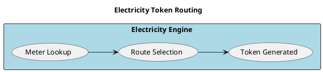
17. Bank Deposits → Trader Treasury

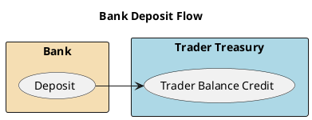
18. Admin Batch Jobs
 
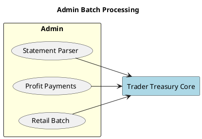
19. Banking Clearance Layer
 
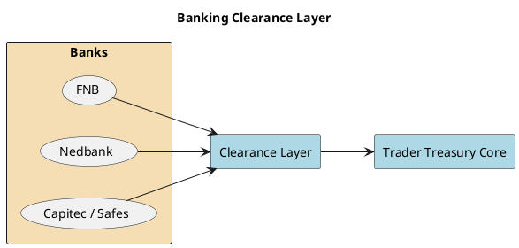
20. Levy Collection (SMS Client)
plantuml
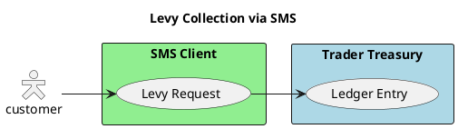
21. Voucher Issuance
 
```plantuml-svg
@startuml
Title Voucher Issuance

left to right direction
skinparam packageStyle rectangle
skinparam actorStyle Hollow
actor customer

rectangle "Trader Treasury" #lightblue {
    (Generate Voucher)
}

rectangle "Voucher Store" #lightgray {
    (Generate Voucher) --> (Stored Voucher)
}
@enduml  
```
22. Airtime / Data Top-Up via MNO

```plantuml
@startuml
Title Airtime & Data Top-Up via MNO

left to right direction
skinparam packageStyle rectangle

rectangle "Trader Treasury" #lightblue {
    (Trader Balance)
}

rectangle "Switch Engine" #lightgreen
rectangle "MNO API" #wheat

(Trader Balance) --> (Switch Engine)
(Switch Engine) --> (MNO API)
(MNO API) --> (Top-Up Success)
@enduml  
```


# Trader Treasury System - PlantUML Diagrams

## 1. Customer Buys Airtime (Vodacom R29)

**Encoded:** `RP4nJyCm48Nt-nMdTcc6Bcmme1OgnCBILEmdvqYiEdQmBrG1zRzZnqbK93pU--xTk_Ck27dfMmCdBORnkG_YMlRur0y1D--k8kLQFDxT5xZNNdJB08O_1CMXrtKZM6dFIhIp4CxQTkIfnOxKcMekPOYUIIPR6xu1I8dpMNvrnhWBZ1LKqto0fGjNPKVVX6NZkXMkJHewSEh17y3u_dNTNpX4en78rYTFLLniNNjc2wCmJyFjzd7M7sBUpvw38ELzq_8PludqOYWqUE0lhNWEDHfFcTAR39FtPheTlh7jYuNuMyxaTF8CNU4Ai9GoS6J5kfC2Tcoh-7E_`


**SVG:** https://www.plantuml.com/plantuml/svg/RP4nJyCm48Nt-nMdTcc6Bcmme1OgnCBILEmdvqYiEdQmBrG1zRzZnqbK93pU--xTk_Ck27dfMmCdBORnkG_YMlRur0y1D--k8kLQFDxT5xZNNdJB08O_1CMXrtKZM6dFIhIp4CxQTkIfnOxKcMekPOYUIIPR6xu1I8dpMNvrnhWBZ1LKqto0fGjNPKVVX6NZkXMkJHewSEh17y3u_dNTNpX4en78rYTFLLniNNjc2wCmJyFjzd7M7sBUpvw38ELzq_8PludqOYWqUE0lhNWEDHfFcTAR39FtPheTlh7jYuNuMyxaTF8CNU4Ai9GoS6J5kfC2Tcoh-7E_

---

## 2. Cash Deposit → Trader Treasury Credit

**Encoded:** `RL6xRiCm3Dpv5KIoD4D-84EHFeRkpW-mCYiBaIM1eX4uGVwzaXz56rIB0DxnxdGwPYNHeVTmSkePtoXt-EwiKtSbTJ6WHZm9jIpbOig3Z02UlxG2ucods3fXKxcGpoua4kenaJcJvKR78bfX2jRpBm8PZJB37z7xU85fWcR86diMW9yjt3I9heHD5zC6jxwQZbnty0POph-gBnVEHMWYpDBBCxPMc0DCmEg6-_tpYX_Gr19QJZ4xXVkV90zLh74-_S1Bc8LH1P-M8kTQTnFyC9jvoyuhUGg6TyNpoA4jl_8D`


**SVG:** https://www.plantuml.com/plantuml/svg/RL6xRiCm3Dpv5KIoD4D-84EHFeRkpW-mCYiBaIM1eX4uGVwzaXz56rIB0DxnxdGwPYNHeVTmSkePtoXt-EwiKtSbTJ6WHZm9jIpbOig3Z02UlxG2ucods3fXKxcGpoua4kenaJcJvKR78bfX2jRpBm8PZJB37z7xU85fWcR86diMW9yjt3I9heHD5zC6jxwQZbnty0POph-gBnVEHMWYpDBBCxPMc0DCmEg6-_tpYX_Gr19QJZ4xXVkV90zLh74-_S1Bc8LH1P-M8kTQTnFyC9jvoyuhUGg6TyNpoA4jl_8D

---

## 3. Trader Treasury → Airtime Token

**Encoded:** `TP113e9034NtFKM36rXu1ODkT2yNg4F52MN6b193Z7TtG4FKn6wQ_DVV_hJiZTI6Jg3o9eoLKisQ6bC_w8WMSUlLV9TGR3a029zjajKt5yFQAplpCK3V-d0bfGwlv5fg-6XZMZXX2etmnm0vY_h2XoWIRp0hw8RUOiSAiBWm-qcKuKgcooSP6E-0gVBto8w4WkC2r-iDvdiEh6JydR-01y0_DXkN42M7EZtc2G00`


**SVG:** https://www.plantuml.com/plantuml/svg/TP113e9034NtFKM36rXu1ODkT2yNg4F52MN6b193Z7TtG4FKn6wQ_DVV_hJiZTI6Jg3o9eoLKisQ6bC_w8WMSUlLV9TGR3a029zjajKt5yFQAplpCK3V-d0bfGwlv5fg-6XZMZXX2etmnm0vY_h2XoWIRp0hw8RUOiSAiBWm-qcKuKgcooSP6E-0gVBto8w4WkC2r-iDvdiEh6JydR-01y0_DXkN42M7EZtc2G00

---

## 4. Best Case Airtime Purchase

**Encoded:** `LP11Ri9034NtSmeBDks2ArJGI5MNYEO2xiHDB3mnydX0jEhTEv1GWNV-_ttRyZexcfSaeMKNWbVA3WrcWWsRSoBO5ej35K8G-d9m1UD-SEZOA3hh6FAUnmCQ9ZXWt6DF7twkeousZhtG7O3HrIRxNKNq5AuAn99T4ra8_obOj8OT6RH6c8kTeL6Z1IpbilvJ2i5FW5gtBAnMB_2qAJweyJSzNysxVl9tbCcE16zbxFBCF6eJrw08R4sFN6-OkKTjvZGbzjkutx2ciQll_0C0`


**SVG:** https://www.plantuml.com/plantuml/svg/LP11Ri9034NtSmeBDks2ArJGI5MNYEO2xiHDB3mnydX0jEhTEv1GWNV-_ttRyZexcfSaeMKNWbVA3WrcWWsRSoBO5ej35K8G-d9m1UD-SEZOA3hh6FAUnmCQ9ZXWt6DF7twkeousZhtG7O3HrIRxNKNq5AuAn99T4ra8_obOj8OT6RH6c8kTeL6Z1IpbilvJ2i5FW5gtBAnMB_2qAJweyJSzNysxVl9tbCcE16zbxFBCF6eJrw08R4sFN6-OkKTjvZGbzjkutx2ciQll_0C0

---

## 5. Non-Ideal Case – Provider Switching

**Encoded:** `NP1D2i9038NtEKMe6xle1Lo8FoYu4R5U84xZD3YTwaogY7XtgvKYpUgHzzv7o2mg1Mqg1mTHnxYjVROfc1mkAV84Tw6-IS41yxkeASLR0CSdHQqnY2qL2mbiL6eFyIp-Ge4gl90va-LS7otoOvEtZW5wYKd7mvMtuZd1aVl0ZgvXV0AsCzxpjU6eAMRP5CVz7VEqi_yMNM9DudxULmvwYs5lyKlaZJ4SOmelcB4lsbUy0G00`


**SVG:** https://www.plantuml.com/plantuml/svg/NP1D2i9038NtEKMe6xle1Lo8FoYu4R5U84xZD3YTwaogY7XtgvKYpUgHzzv7o2mg1Mqg1mTHnxYjVROfc1mkAV84Tw6-IS41yxkeASLR0CSdHQqnY2qL2mbiL6eFyIp-Ge4gl90va-LS7otoOvEtZW5wYKd7mvMtuZd1aVl0ZgvXV0AsCzxpjU6eAMRP5CVz7VEqi_yMNM9DudxULmvwYs5lyKlaZJ4SOmelcB4lsbUy0G00

---

## 6. Trader Treasury – High-Level Components

**Encoded:** `RL7BJiCm4BplLwoAXEWXlu1QHU8XzO1AVs19XjIgOuVr1XGG_uwZjA26-c9xPdPcBA-IYLhVUjevy-2TIWtD6oJrEl23Q_R51k_mNCQsYm714f77gx55ramRrqvHcOk1qi65JbHQxgGwI8Dd6xBhI4jeF8X-ZxnOFptolHW-P5ZmbH-j6WK2Vn7dTLDwbzDuYxSUoPRqVJOzRrf6nSdcnVSukQnxsqTrdp8MN4xO7P3uUdnHwrBAU3eIMrGnLCwxe_eySeEwWVvrbO5etfABulPVwEm-QIwLk0HEwYbxIIk4Ed_N3m00`


**SVG:** https://www.plantuml.com/plantuml/svg/RL7BJiCm4BplLwoAXEWXlu1QHU8XzO1AVs19XjIgOuVr1XGG_uwZjA26-c9xPdPcBA-IYLhVUjevy-2TIWtD6oJrEl23Q_R51k_mNCQsYm714f77gx55ramRrqvHcOk1qi65JbHQxgGwI8Dd6xBhI4jeF8X-ZxnOFptolHW-P5ZmbH-j6WK2Vn7dTLDwbzDuYxSUoPRqVJOzRrf6nSdcnVSukQnxsqTrdp8MN4xO7P3uUdnHwrBAU3eIMrGnLCwxe_eySeEwWVvrbO5etfABulPVwEm-QIwLk0HEwYbxIIk4Ed_N3m00

---

## 7. Response & Reconciliation

**Encoded:** `HOz13e9034NtSue6Dx3m2eR4nBKHBb2PYWr3XtJAWXZlxW1Hk-hF_tdzhPEXsZm6rx85WXkbAKeYGF5PT54w3ep6KPmBz32m2Chzqy2pKhSPQM2PK7642Ri1UsfioQpLHka3EVTReMWLFIcqIfXcNU0SbGeuX9Lv3pF1oq6UyahYMVeSH4cu7QhWU3n1-Qr5rPxywzs_i620nj1ouktg3CeFVW00`


**SVG:** https://www.plantuml.com/plantuml/svg/HOz13e9034NtSue6Dx3m2eR4nBKHBb2PYWr3XtJAWXZlxW1Hk-hF_tdzhPEXsZm6rx85WXkbAKeYGF5PT54w3ep6KPmBz32m2Chzqy2pKhSPQM2PK7642Ri1UsfioQpLHka3EVTReMWLFIcqIfXcNU0SbGeuX9Lv3pF1oq6UyahYMVeSH4cu7QhWU3n1-Qr5rPxywzs_i620nj1ouktg3CeFVW00

---

## 8. Trader App Evolution

**Encoded:** `VP712i9G38NlynIfbuT43oqwAWGelqBWOB9WsGRG4xpqYUvajh7dE1yF_lPdx8aUJuwzKaNXZ3W2hMWPbX1fexEefPa5bR-5mL4s95zJmqGxeaZiWq0s4U3KADm6KaJPcCLUO0oUr1K2F7QNCo1BgYj9LPF0rInoqM1Wg_ZaDUQa4P1gZjP18JGBFPyLIvuZ-pGXttWY1C3G2Kt6CuEQKxzMRkZNx2gNMWFGaboPIQdGHgbAOL9YCOg6XZ_LvQz-mQqVKYV8UjZvIGvTy5Y_w5Jz_G6PFd_6d0CQd2jvZlc-E8oXQrL_Z5vZm9lUNq0`


**SVG:** https://www.plantuml.com/plantuml/svg/VP712i9G38NlynIfbuT43oqwAWGelqBWOB9WsGRG4xpqYUvajh7dE1yF_lPdx8aUJuwzKaNXZ3W2hMWPbX1fexEefPa5bR-5mL4s95zJmqGxeaZiWq0s4U3KADm6KaJPcCLUO0oUr1K2F7QNCo1BgYj9LPF0rInoqM1Wg_ZaDUQa4P1gZjP18JGBFPyLIvuZ-pGXttWY1C3G2Kt6CuEQKxzMRkZNx2gNMWFGaboPIQdGHgbAOL9YCOg6XZ_LvQz-mQqVKYV8UjZvIGvTy5Y_w5Jz_G6PFd_6d0CQd2jvZlc-E8oXQrL_Z5vZm9lUNq0

---

## 9. Request Lifecycle

**Encoded:** `LP0n3e90343lEvJKs3i64DIbpJQ1YQd2nTYLXoYPaObzkGCnFFjxFV_OxY_3MXEqFqO2T9GMKMajexAgjcP5EJJcZX8KX8I-tKfLVz_GOHqDLAZe5mjPr9C2IWKHslnoZlCxGPbfbNqtw5ykZ0vb_3pJTbM7wf79aJykJmy0`


**SVG:** https://www.plantuml.com/plantuml/svg/LP0n3e90343lEvJKs3i64DIbpJQ1YQd2nTYLXoYPaObzkGCnFFjxFV_OxY_3MXEqFqO2T9GMKMajexAgjcP5EJJcZX8KX8I-tKfLVz_GOHqDLAZe5mjPr9C2IWKHslnoZlCxGPbfbNqtw5ykZ0vb_3pJTbM7wf79aJykJmy0

---

## 10. Authorization Rules

**Encoded:** `NP1D2W9034NtVONH7s_u1V2t0e8Hjq2b86U4LBBEi17lmWYW_uT-pJ2U-NjpC_jc04IKf2k7RbcIkqPQqHRRHZOY4s11SBlN-3mOByEF04J79RqLW0x9aqhA0_bxdqc3ECt43uB-N86F7E1JWJ30j4yfO9NnMpW_rkFcGYTcTJ_m_Dxz1NR5ksGrqxP7bpDFjfkrFKQ-c-JVW00`


**SVG:** https://www.plantuml.com/plantuml/svg/NP1D2W9034NtVONH7s_u1V2t0e8Hjq2b86U4LBBEi17lmWYW_uT-pJ2U-NjpC_jc04IKf2k7RbcIkqPQqHRRHZOY4s11SBlN-3mOByEF04J79RqLW0x9aqhA0_bxdqc3ECt43uB-N86F7E1JWJ30j4yfO9NnMpW_rkFcGYTcTJ_m_Dxz1NR5ksGrqxP7bpDFjfkrFKQ-c-JVW00

---

## 11. Airtime Transaction Example

**Encoded:** `LP5B3e9034RtVOhH7s_u1V2t10IbBq2bY6zW1S5Tq7ZTOaHdNFz-pJ2U-BhpC-_c2IEHn2kXR9cYj4TQuA78uy41wEMEGrtmM_bnMyTMWKGVPeUge3fGgN8H4Y_EpZeE-G5F7pKrBjTa70nkIqMVg_yOlWopXpuJJFqTBljv_Nu-lFTgTdx_3GzfwPcXdBsJl_82m00`


**SVG:** https://www.plantuml.com/plantuml/svg/LP5B3e9034RtVOhH7s_u1V2t10IbBq2bY6zW1S5Tq7ZTOaHdNFz-pJ2U-BhpC-_c2IEHn2kXR9cYj4TQuA78uy41wEMEGrtmM_bnMyTMWKGVPeUge3fGgN8H4Y_EpZeE-G5F7pKrBjTa70nkIqMVg_yOlWopXpuJJFqTBljv_Nu-lFTgTdx_3GzfwPcXdBsJl_82m00

---

## 12. Purchase & Fund Reservation

**Encoded:** `TP0n3i8m34NtFSMf4zhe28WawIBH4nZ0P4qKe5QE49xtW3HY_dRyVF_kJ7x5xq3P9O4kY-4v3zfEjvdj0ZT2LJqLqPOC3rrlAJgkPGwrJZ36H-sK2HGw2D6e--5G4iNQN5C2UBIJFLhCi6VePIDO16B-9bGPBUHPnb5pv9jAOCLAzDcH_kE-ApLx3Wod79tJjl3vWvYEU5OJdOIlBzB9HVOI1u-xpQz0sR_2uCeVgcYuzQdU5NphE_rtE9-R_8Vl_0K0`


**SVG:** https://www.plantuml.com/plantuml/svg/TP0n3i8m34NtFSMf4zhe28WawIBH4nZ0P4qKe5QE49xtW3HY_dRyVF_kJ7x5xq3P9O4kY-4v3zfEjvdj0ZT2LJqLqPOC3rrlAJgkPGwrJZ36H-sK2HGw2D6e--5G4iNQN5C2UBIJFLhCi6VePIDO16B-9bGPBUHPnb5pv9jAOCLAzDcH_kE-ApLx3Wod79tJjl3vWvYEU5OJdOIlBzB9HVOI1u-xpQz0sR_2uCeVgcYuzQdU5NphE_rtE9-R_8Vl_0K0

---

## 13. Product Types

**Encoded:** `LP112i8m48Nl_HM3_m8lVWKJAoD2LhW51zJ5X4YxaeIRwkGxgF_VVlMtyU3yPaeKvW4zFqcvYf_bD1tEmX2t6aTcY-oWN8F-3mMlzkPMWE4OTQX43bGgNAJ8i--JJGcw-TsWB8FV_W00`


**SVG:** https://www.plantuml.com/plantuml/svg/LP112i8m48Nl_HM3_m8lVWKJAoD2LhW51zJ5X4YxaeIRwkGxgF_VVlMtyU3yPaeKvW4zFqcvYf_bD1tEmX2t6aTcY-oWN8F-3mMlzkPMWE4OTQX43bGgNAJ8i--JJGcw-TsWB8FV_W00

---

## 14. Failure Handling

**Encoded:** `LP112e9034Nl_HM3KzxO0rp25S_GAN1IQVYK7YjqarE_x43HN-Bxz_hRiVpExakMQ52zFqcv4e_bFq-fLF51Kfa2NTzw2NKEtOhkRJNhY0HPTQecEbugN4HMF--lG6oZ_T8G79FRx0W0`


**SVG:** https://www.plantuml.com/plantuml/svg/LP112e9034Nl_HM3KzxO0rp25S_GAN1IQVYK7YjqarE_x43HN-Bxz_hRiVpExakMQ52zFqcv4e_bFq-fLF51Kfa2NTzw2NKEtOhkRJNhY0HPTQecEbugN4HMF--lG6oZ_T8G79FRx0W0

---

## 15. PIN-less Delivery Principle

**Encoded:** `JOzB3e9034NtFKMf6KZxW8gDyXJ24a3M1Vo01WYWd77b_u7gXilb-_yxMu-o1SIbD6OLWrk1BXIV7ljpWy2xNu22x7N8s-bmOFzcNgT3F-H9M2k71pqtnWC0`


**SVG:** https://www.plantuml.com/plantuml/svg/JOzB3e9034NtFKMf6KZxW8gDyXJ24a3M1Vo01WYWd77b_u7gXilb-_yxMu-o1SIbD6OLWrk1BXIV7ljpWy2xNu22x7N8s-bmOFzcNgT3F-H9M2k71pqtnWC0

---

## 16. Electricity Token Routing

**Encoded:** `NOyn3i8m34LtdyA2fHrw1TIbOe65zWAXDS5AwbIfCrI8kvCg4a9uikodv-zsLHCrpHu6La_OUHeryiYwuH0S2Tv2KXOBuEcXg04ZswVYn36J70HMnxAOQ6PSpEYCfLwtRDhNHgmdW6-BXrz_9vQ53dZqk_7k4-4BC5Tr9QM8bn1SMcficXDMUmp2ddovMXVmVrhO4lnCGj4eJJMyeIMPyfSV`


**SVG:** https://www.plantuml.com/plantuml/svg/NOyn3i8m34LtdyA2fHrw1TIbOe65zWAXDS5AwbIfCrI8kvCg4a9uikodv-zsLHCrpHu6La_OUHeryiYwuH0S2Tv2KXOBuEcXg04ZswVYn36J70HMnxAOQ6PSpEYCfLwtRDhNHgmdW6-BXrz_9vQ53dZqk_7k4-4BC5Tr9QM8bn1SMcficXDMUmp2ddovMXVmVrhO4lnCGj4eJJMyeIMPyfSV

---

## 17. Bank Deposits → Trader Treasury

**Encoded:** `NOz12eD034NtEKMm6xlm2aLiwGNg1L8drS4uIYOYKdhtZbGARLQ1_FS-AQEHsZm8rDw4iQBGuuMdCNh3gumBWF33q4PKttQ6pYitviS0iVTX8gK19sfwQlbcQp9iPmgjCC1tnMppPdXOEYR39s2QVAyvmkidMYivLgoLASww9agsvhlC_4zYKPmmtu6AX4B3U5Ps7sl9mQNNtW00`


**SVG:** https://www.plantuml.com/plantuml/svg/NOz12eD034NtEKMm6xlm2aLiwGNg1L8drS4uIYOYKdhtZbGARLQ1_FS-AQEHsZm8rDw4iQBGuuMdCNh3gumBWF33q4PKttQ6pYitviS0iVTX8gK19sfwQlbcQp9iPmgjCC1tnMppPdXOEYR39s2QVAyvmkidMYivLgoLASww9agsvhlC_4zYKPmmtu6AX4B3U5Ps7sl9mQNNtW00

---

## 18. Admin Batch Jobs

**Encoded:** `VP1D2i9038NtEKNGZLru1V7d0gAzG6nZ3QOpaacH8jxTgNyWYbc5b-IzZyoJatdNAfJYohYeMmcu9AyEkBPOSKeI6W3blQD7D6aEZhKOLounG3fAE95HYoUgZjJmrljiCumfDCe0xnP7T_CHZdKmwLardl42c6koTN9kEJYkoH9RyP0pmbu6hHzcwQbks4dqGLd0zIEZDAhPi3Icr5cFgsZyYjnfbu6-it0wdU7arsK1NmX_bp_8_ctEETJvwpS0`


**SVG:** https://www.plantuml.com/plantuml/svg/VP1D2i9038NtEKNGZLru1V7d0gAzG6nZ3QOpaacH8jxTgNyWYbc5b-IzZyoJatdNAfJYohYeMmcu9AyEkBPOSKeI6W3blQD7D6aEZhKOLounG3fAE95HYoUgZjJmrljiCumfDCe0xnP7T_CHZdKmwLardl42c6koTN9kEJYkoH9RyP0pmbu6hHzcwQbks4dqGLd0zIEZDAhPi3Icr5cFgsZyYjnfbu6-it0wdU7arsK1NmX_bp_8_ctEETJvwpS0

---

## 19. Banking Clearance Layer

**Encoded:** `TP7Dgi9034RtUOgWczk5-0OY5bo96_i2iVsiW-EqP5Aao7ttErMHMt-oIYQ7BmTc6KtKkhEdmfa7hoISNAWvzn2LK88tqaE9F0x6rh2w-cXSEKLfhWaK4zuczCojb2UfiRC-vGnh2RK7qRFboP0U9poz7276L-9KF-ljAhjtMrJxH3ocN5fdA7dEEpaWPlGxodenJAb-KDlx3l-nGgM2Sg6Gs6dFUQCOiNGJuDbiaKwECpDwAdtRlqf-uUZjwGv-iijeYL2bB_a3`


**SVG:** https://www.plantuml.com/plantuml/svg/TP7Dgi9034RtUOgWczk5-0OY5bo96_i2iVsiW-EqP5Aao7ttErMHMt-oIYQ7BmTc6KtKkhEdmfa7hoISNAWvzn2LK88tqaE9F0x6rh2w-cXSEKLfhWaK4zuczCojb2UfiRC-vGnh2RK7qRFboP0U9poz7276L-9KF-ljAhjtMrJxH3ocN5fdA7dEEpaWPlGxodenJAb-KDlx3l-nGgM2Sg6Gs6dFUQCOiNGJuDbiaKwECpDwAdtRlqf-uUZjwGv-iijeYL2bB_a3

---

## 20. Levy Collection (SMS Client)

**Encoded:** `LP11Ri9034NtFeK56xhW2WW9LMBHRffSm4tSOOGp0nuFLOIuEvE48F3I___tBM-JaLhk16flmlZ5bnvtKOGRyp7WnHDMtnM0y9-XHLJl3eQjrya0wUZ3YPGwF55p9CULzOKpo1ISy8k16eiwoVlI4FzXt62JayME5U2PmaKfnPru3hR0fGobJfa3NW7Bp15ShpUu6e_-uNFcP1zmU-FKIctnrSgKilOpx5SoFrZlyPdOkfBw3ARzGDnoQCkJxW00`


**SVG:** https://www.plantuml.com/plantuml/svg/LP11Ri9034NtFeK56xhW2WW9LMBHRffSm4tSOOGp0nuFLOIuEvE48F3I___tBM-JaLhk16flmlZ5bnvtKOGRyp7WnHDMtnM0y9-XHLJl3eQjrya0wUZ3YPGwF55p9CULzOKpo1ISy8k16eiwoVlI4FzXt62JayME5U2PmaKfnPru3hR0fGobJfa3NW7Bp15ShpUu6e_-uNFcP1zmU-FKIctnrSgKilOpx5SoFrZlyPdOkfBw3ARzGDnoQCkJxW00

---

## 21. Voucher Issuance

**Encoded:** `TP0n3i8m34LtdyA2fGnS0R41CnMxIKo8cYR8SOGgnDq9HKLbmAFz_Vwtjrb9jFG1Mg-1yPIAkRBW8UT2qJ10u8kY9XJlhehM2nlrAKBkVBoHK8ytCXqvFkfG0UynHHTu9Y2ZIJxZVGeXtM7ie2bPKyy2yDt2HIjaQu1Mc7AHOO7By7O-XyBu0ApLx3Yoa7xJhk3vWvYEE5OJdW1EQFWBmFLwWysejtFgbgEjpta1`


**SVG:** https://www.plantuml.com/plantuml/svg/TP0n3i8m34LtdyA2fGnS0R41CnMxIKo8cYR8SOGgnDq9HKLbmAFz_Vwtjrb9jFG1Mg-1yPIAkRBW8UT2qJ10u8kY9XJlhehM2nlrAKBkVBoHK8ytCXqvFkfG0UynHHTu9Y2ZIJxZVGeXtM7ie2bPKyy2yDt2HIjaQu1Mc7AHOO7By7O-XyBu0ApLx3Yoa7xJhk3vWvYEE5OJdW1EQFWBmFLwWysejtFgbgEjpta1

---

## 22. Airtime / Data Top-Up via MNO

**Encoded:** `NP1DQiD038NtEiKZXH8lV8MIb7RHHN_0xW7KiJeM6O_DZDmGIk_U2N5A4wsUz9u-X3RPEDay16hLWc2hoNGGtEA1ZT6EK_q-uKiPpo-lH44-3JOYgUyDdIPnfcEalDCuSU814xiTUsdiK6X7cwCFGlGdiMeJTvBG9k4yfyCAD-68-mYpu9jGQhr4xZbmT5BHpmMWsQkv7e_HQvJpkayYyN-g78pjsrFnzxsm4LrJKTTtM5_0AhhgJva5LTopEisNzpIpSv9pHHk9NVdbBm00`


**SVG:** https://www.plantuml.com/plantuml/svg/NP1DQiD038NtEiKZXH8lV8MIb7RHHN_0xW7KiJeM6O_DZDmGIk_U2N5A4wsUz9u-X3RPEDay16hLWc2hoNGGtEA1ZT6EK_q-uKiPpo-lH44-3JOYgUyDdIPnfcEalDCuSU814xiTUsdiK6X7cwCFGlGdiMeJTvBG9k4yfyCAD-68-mYpu9jGQhr4xZbmT5BHpmMWsQkv7e_HQvJpkayYyN-g78pjsrFnzxsm4LrJKTTtM5_0AhhgJva5LTopEisNzpIpSv9pHHk9NVdbBm00

---

## Usage Notes

Each diagram includes:
- **Encoded string**: For programmatic use or direct URL construction
- **PNG Image**: Embedded inline for immediate viewing
- **SVG Link**: For scalable vector graphics

To use these diagrams:
1. Copy the encoded string for API/programmatic usage
2. Click the PNG image to view directly
3. Use the SVG link for high-quality vector output in documentation